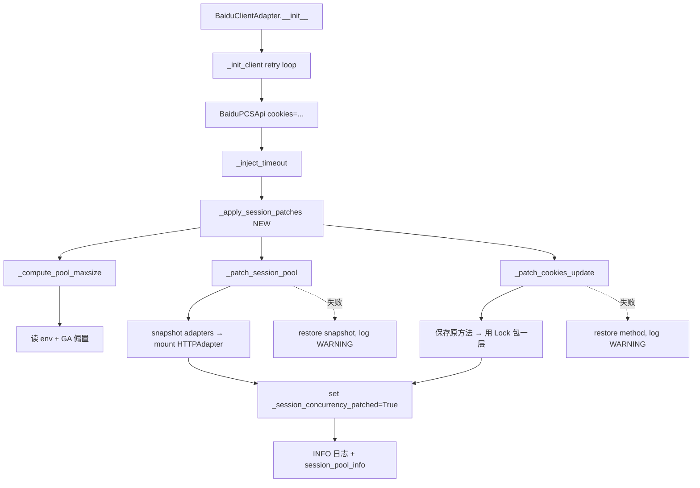

# Design Document

## Overview

本特性在 `BaiduClientAdapter._init_client` 现有的 `_inject_timeout` 之后追加一组新的运行时 monkey-patch，统称 **Round_Trip_Patch**。它解决两个真实瓶颈：

1. **连接池容量**：`requests.Session()` 默认 `pool_maxsize=10`，与项目内已有的并发改造（`MULTI_SHARE_CONCURRENCY × {scan, transfer, rename}`）不匹配，并发 ≥ 4 时会出现 `Connection pool is full, discarding connection`，每次新建 TCP/TLS。
2. **Cookie 更新原子性**：`access_shared` / `shared_paths` 等路径在多线程下会触发 `_cookies_update`，目前没有显式保护"`_session.cookies.update` + `_cookies.update`"这对操作的原子性。

设计原则与 `_inject_timeout` 完全一致：
- vendor `BaiduPCS-Py` 子模块**不动一行**；
- 全部增强通过 `storage_client.py` 在初始化阶段注入；
- 用 `_session_concurrency_patched` 标记保证幂等；
- 任意 patch 步骤失败都通过快照-回滚降级，主流程不受影响（Requirement 9）。

## Architecture



调用层关系（既有不变）：

```
BaiduStorage
  └ self.client : BaiduClientAdapter
        ├ self.client : BaiduPCSApi
        │     └ ._pcs : BaiduPCS
        │            ├ ._session : requests.Session  ← Round_Trip_Patch 替换 adapters
        │            └ ._cookies_update              ← Round_Trip_Patch 加锁
        ├ call_with_retry(...)                       (与本特性正交)
        └ session_pool_info                          (新增可观测属性)
```

## Components and Interfaces

### `env_utils.read_non_negative_int_env(name, default)` *(新增)*

允许显式 `0` 的整数读取器，与已有 `read_positive_int_env` 区别在于：值 `0` 是合法的（用于 `TRANSFERSHARE_PCS_POOL_MAXSIZE=0` 显式禁用连接池调优）。

```python
def read_non_negative_int_env(name: str, default: int) -> int:
    """读取非负整数环境变量；非法值（负数 / 非整数）回退到 default。"""
```

### `BaiduClientAdapter` 新增字段

```python
self._session_cookie_lock: threading.Lock | None = None     # _patch_cookies_update 后填充
self._session_pool_info: dict = {                          # session_pool_info 的后端
    "pool_maxsize": 0,
    "pool_connections": 0,
    "fanout": 0,
    "patched": False,
}
self._session_patches_applied: bool = False                # 区别于 pcs_candidate._session_concurrency_patched
```

`pcs_candidate._session_concurrency_patched`（**写在 pcs 候选对象上**）用于跨多次 `BaiduClientAdapter` 实例化时也幂等；`self._session_patches_applied` 用于 adapter 自身状态查询。

### 新增方法（全部在 `BaiduClientAdapter` 内）

| 方法 | 角色 | 关键行为 |
|---|---|---|
| `_apply_session_patches(pcs_candidate)` | 入口编排 | 检查 `_session_concurrency_patched` 标记 → 依次 `_patch_session_pool` / `_patch_cookies_update` → 设标记 → INFO 日志 |
| `_patch_session_pool(pcs_candidate)` | 替换 HTTPAdapter | 1) 校验 `_session` 是 `requests.Session` 实例；2) 读 `_compute_pool_maxsize()`；3) 快照 `dict(_session.adapters)`；4) 用 `pool_block=False` 的新 `HTTPAdapter` 挂 `https://` / `http://`；5) 异常时还原快照 |
| `_patch_cookies_update(pcs_candidate)` | 包裹 `_cookies_update` | 1) 校验 `_cookies_update` 存在；2) 保存原 bound method；3) 创建 `threading.Lock` 存入 `self._session_cookie_lock`；4) 替换为新闭包，闭包内 `with lock:` 调用原方法；5) 异常时还原原方法 |
| `_compute_pool_maxsize()` | 容量决策 | 按 Requirement 6 决定 GA 偏置；遵守 `TRANSFERSHARE_PCS_POOL_MAXSIZE=0` 禁用语义；返回 `(pool_maxsize, pool_connections, fanout)` |
| `session_pool_info` *(@property)* | 只读快照 | 直接返回 `dict(self._session_pool_info)` 的副本 |

### 类属性 hook（用于测试）

```python
class BaiduClientAdapter:
    _pcs_factory = staticmethod(BaiduPCSApi)   # 测试中可 patch 成 fake
```

`_init_client` 中改为 `self.client = type(self)._pcs_factory(cookies=cookies_dict)`，允许测试在不替换 `BaiduPCSApi` import 的情况下注入伪造工厂。

### 新增环境变量

| 变量 | 默认 | 说明 |
|---|---|---|
| `TRANSFERSHARE_PCS_POOL_MAXSIZE` | unset → 走 `_compute_pool_maxsize` 内部默认；`0` 表示禁用 patch | HTTPAdapter `pool_maxsize` / `pool_connections` 显式覆盖 |
| `TRANSFERSHARE_PCS_POOL_FANOUT` | `4` | 每个并发链接预留的连接数倍率 |
| `TRANSFERSHARE_PCS_DEBUG_POOL` | `0` | 设 `1` 时在 DEBUG 级别打印每次 `call_with_retry` 完成后的池状态 |

## Data Models

### `session_pool_info` 形状

```python
{
    "pool_maxsize": int,      # 实际 mount 的 pool_maxsize
    "pool_connections": int,  # 实际 mount 的 pool_connections
    "fanout": int,            # 计算时使用的 fanout 值
    "patched": bool,          # True = HTTPAdapter 替换成功；cookie patch 状态独立见日志
}
```

### INFO 日志结构（Requirement 7 AC1）

```
会话并发 patch 已启用: pool_maxsize=40 pool_connections=40 fanout=4 ga_environment=true patched_cookies_update=true
```

字段以 `key=value` 形式拼接，方便 GitHub Actions 日志的纯文本检索（不引入 JSON 序列化依赖）。

### DEBUG 日志（`TRANSFERSHARE_PCS_DEBUG_POOL=1`）

```
会话池状态: scheme=https:// pool_connections=40 num_pools=1
```

仅在 `urllib3.PoolManager` 暴露 `pools` 属性时打印；不暴露则跳过，不报错。

## Error Handling

| 触发点 | AC | 失败时动作 | 日志级别 |
|---|---|---|---|
| `_patch_session_pool` 中 `mount()` 抛异常 | 9.1 / 4.4 | `_session.adapters` 还原快照；`_session_pool_info["patched"]=False`；继续 `_patch_cookies_update` | WARNING |
| `_patch_cookies_update` 中 setattr 抛异常 | 9.2 / 4.4 | 还原原 `_cookies_update`；`self._session_cookie_lock=None`；HTTPAdapter 替换结果**保留** | WARNING |
| `pcs_candidate._session` 不是 `requests.Session` | 1.7 | 跳过整个 `_apply_session_patches`；`session_pool_info["patched"]=False` | WARNING |
| `pcs_candidate` 未暴露 `_cookies_update` | 2.6 | 跳过 cookie patch；HTTPAdapter 替换照常进行 | DEBUG |
| `pcs_candidate._session_concurrency_patched=True` | 3.1 | 跳过整个 `_apply_session_patches` | DEBUG |
| 环境变量解析失败 | 5.3 | 回退默认值 | WARNING |
| `TRANSFERSHARE_PCS_POOL_MAXSIZE=0` | 1.6 | 跳过 HTTPAdapter 替换；cookie patch 仍执行 | DEBUG |

**关键不变量**：任何 patch 失败都不会让 `_init_client` 抛异常给 `BaiduStorage`。`self.client` 与 `self._quota_info` 在所有路径下都被赋值（Requirement 9.3）。

## Testing Strategy

测试全部加入 `tests/test_storage.py::BaiduClientAdapterTests`（保留现有结构）。所有测试不发起真实 HTTP，使用 `Mock` + `requests.Session()` 实例。

### 单元测试清单

1. **`test_compute_pool_maxsize_uses_ga_offset_when_in_actions`**
   - matrix: `(is_github_actions, MULTI_SHARE_CONCURRENCY, env_override) → expected_pool_maxsize`
   - 覆盖 Requirement 6 全部 AC

2. **`test_compute_pool_maxsize_falls_back_on_invalid_env`**
   - `TRANSFERSHARE_PCS_POOL_FANOUT=bad` → 回退到 4
   - 应记录 WARNING（用 `assertLogs`）

3. **`test_apply_session_patches_is_idempotent`**
   - 同一 `pcs_candidate` 调用 `_apply_session_patches` 两次
   - 断言 `_session.mount` 仅被调用一次（用真实 `requests.Session()` + `mock.patch.object(session, "mount", wraps=session.mount)`）

4. **`test_patch_session_pool_replaces_https_and_http_adapters`**
   - 真实 `requests.Session()` + `pcs_candidate = SimpleNamespace(_session=session)`
   - 调用 `_patch_session_pool(pcs_candidate)`
   - 断言 `session.adapters["https://"].poolmanager.connection_pool_kw["maxsize"]` 等预期值

5. **`test_patch_session_pool_rolls_back_on_mount_failure`**
   - `mount()` 第二次调用抛异常
   - 断言 adapters 字典恢复到 patch 前
   - 断言 `_session_pool_info["patched"] is False`

6. **`test_patch_cookies_update_serializes_concurrent_updates`**
   - 用 `threading.Barrier` 让 N 个线程同时进入被 patch 后的 `_cookies_update`
   - 在原方法中 `time.sleep(0.01)` 模拟非原子写
   - 断言每次 jar 状态都是某次 update 的完整快照（用记录序列检查）

7. **`test_patch_cookies_update_rolls_back_when_setattr_fails`**
   - 让 `setattr(pcs_candidate, "_cookies_update", ...)` 抛异常（用 `Mock(spec=...)` 配 `__setattr__`）
   - 断言原方法仍可调用、`self._session_cookie_lock is None`

8. **`test_apply_session_patches_skips_when_session_is_not_requests_session`**
   - `pcs_candidate._session = object()`
   - 断言无异常、`session_pool_info["patched"] is False`、WARNING 日志

9. **`test_apply_session_patches_skips_when_already_patched`**
   - 预先 `pcs_candidate._session_concurrency_patched = True`
   - 断言 `mount()` 未被调用、DEBUG 日志

10. **`test_session_pool_info_is_a_copy`**
    - 修改返回字典不应影响内部状态

11. **`test_init_client_keeps_working_when_session_pool_patch_fails`**
    - 集成：mock `BaiduPCSApi` 返回的 `_pcs._session` 上 `mount()` 抛异常
    - 断言 `BaiduClientAdapter(cookies)` 构造成功、`self.client is not None`、`_quota_info` 已设置

### 与既有测试的兼容

现有 `BaiduClientAdapterRetryTests` 与 `BaiduClientAdapterTests` 通过 `BaiduClientAdapter.__new__(BaiduClientAdapter)` 绕过 `__init__` 构造对象。新字段（`_session_cookie_lock`、`_session_pool_info` 等）需要在用到的方法里 `getattr(self, "_session_pool_info", {...})` 兜底，避免破坏老测试。

## Implementation Phases

### Phase 1 — 基础设施（无副作用）

1. `env_utils.read_non_negative_int_env(name, default)`：新增函数，复用现有解析模式
2. `storage_client.py`：
   - 新增 3 个环境变量常量
   - 新增 `_compute_pool_maxsize()` 纯函数（不依赖 `pcs_candidate`）
   - 新增 `_session_pool_info` 字段（默认全 0）+ `session_pool_info` `@property`
   - 新增 `_pcs_factory` 类属性 hook
3. 单元测试：`test_compute_pool_maxsize_*` 系列、`test_session_pool_info_is_a_copy`

**验收**：211 → 215+ 全过；不影响任何运行时路径。

### Phase 2 — `_patch_session_pool` + 回滚

1. 实现 `_patch_session_pool(pcs_candidate)`：snapshot → mount → 异常时 restore
2. 在 `_init_client` 成功分支中调用（在 `_inject_timeout` 之后）
3. 设置 `pcs_candidate._session_concurrency_patched`（先只标 pool 部分；cookie patch 在 Phase 3 复用同一标记）
4. INFO 日志（仅 pool 部分）
5. 单元测试 4、5、8、9、10、11

**验收**：本地并发 4 链接转存观察 `Connection pool is full` 警告消失；`session_pool_info["patched"]` 为 True；既有测试零失败。

### Phase 3 — `_patch_cookies_update` + 完整可观测性

1. 实现 `_patch_cookies_update(pcs_candidate)`：保存原方法 → Lock 包闭包 → 异常 restore
2. `_apply_session_patches` 编排两个 patch
3. 完整 INFO 日志（pool + cookie）
4. `TRANSFERSHARE_PCS_DEBUG_POOL=1` 的 DEBUG 日志钩入 `call_with_retry`
5. 单元测试 3、6、7
6. 文档：在 README "性能调优" 段落（如已存在）追加新 env 变量说明

**验收**：215+ → 220+ 全过；并发 cookie 写入测试通过；用 `pytest -x` 多次跑无 flake。

## Correctness Properties

下列性质必须在所有路径上成立，作为 review 与测试的硬契约。

### Property 1: 初始化原子性

`BaiduClientAdapter.__init__` 返回时，`self.client` 与 `self._quota_info` 必为非 `None`，与本特性是否启用、是否回滚**无关**。

**Validates: Requirements 9.3, 9.4**

### Property 2: HTTPAdapter 替换可逆

`_patch_session_pool` 失败时，`_session.adapters` 的内容（按 key 顺序与对象身份）必须与进入函数前完全一致；不会出现"半挂载"状态（`https://` 已替换、`http://` 未替换）。实现上通过先 snapshot `dict(_session.adapters)`、`mount()` 失败时恢复字典实现。

**Validates: Requirements 4.4, 9.1**

### Property 3: Cookie 更新可见性

patch 后的 `_cookies_update`：任意外部观察者（包括 `BaiduPCS.cookies` 读取的 `_session.cookies.get_dict()`）所见的 jar 状态，要么是某次 `_cookies_update` 调用前的完整快照，要么是该次调用后的完整快照——不会出现"key 子集"中间态。

**Validates: Requirements 2.3, 4.2**

### Property 4: patch 幂等

对同一 `pcs_candidate` 多次调用 `_apply_session_patches` 仅生效一次；后续调用是 no-op + DEBUG 日志。

**Validates: Requirements 3.1, 3.3**

### Property 5: 不污染 vendor

patch 仅修改 `pcs_candidate._session`、`pcs_candidate._cookies_update` 与 `pcs_candidate._session_concurrency_patched` 三个属性。**不**修改 `BaiduPCS` 类对象本身的方法表（避免污染未来同进程其他 `BaiduPCS` 实例）。

**Validates: Requirements 3.4**

### Property 6: 重试与连接池正交

`call_with_retry` 的重试逻辑不感知 patch 是否启用；patch 仅影响"每次请求拿连接"的延迟分布，不影响"哪些异常应该重试"。

**Validates: Requirements 4.3, 5.4**

### Property 7: GA 偏置幂等

多次调用 `_compute_pool_maxsize()` 返回相同结果（纯函数，仅依赖 `os.environ` 与 `MULTI_SHARE_CONCURRENCY` 常量快照，不维护内部状态）。

**Validates: Requirements 6.1, 6.2, 6.3**

## Open Questions

1. **`pool_block`**：默认 `False`（不阻塞），与 Requirement 1.5 一致。极端瞬时超额请求会走 `urllib3` 的"超额时新建非池连接"路径，吞吐略降但不阻塞调用线程。如果未来观察到 GA 上短时间打爆服务端，可以改为 `True` 并增大 `pool_maxsize`。

2. **`call_with_retry` 是否需要在重试间隙刷新连接池**：当前结论 **否**。`requests.Session` 的连接池是 host-scope 的，`call_with_retry` 重试同一 host 时连接复用是设计预期；强行 close 反而损失 keep-alive 收益。

3. **是否需要把 patch 应用到 `BaiduPCSApi.__init__` 链上的其他 session（如某些版本的 `_pcs.session`）**：通过 `_get_pcs_candidate` 已经覆盖 `_pcs / pcs / baidupcs / _baidupcs`。若未来 vendor 版本引入新的 session 字段，再扩展 candidate 列表即可。
