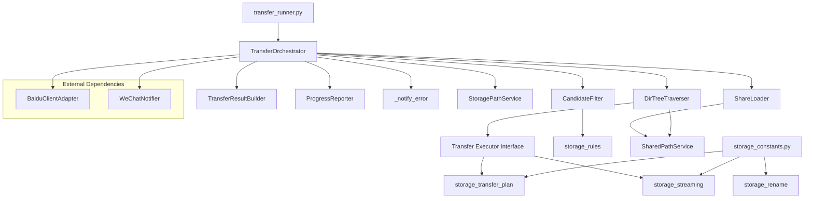

# Design Document: Storage Architecture Refactor

## Overview

This design decomposes the monolithic `BaiduStorage` class (~2000 lines) into focused collaborator classes, each with a single responsibility. The refactoring follows an incremental extraction strategy: new classes are introduced alongside the existing code, wired together via a thin orchestrator, and validated against the full existing test suite at each step.

The key architectural change is moving from a God-class pattern (BaiduStorage does everything) to a composition pattern (TransferOrchestrator delegates to focused collaborators). This enables independent testing, clearer dependency graphs, and removal of the problematic `import storage as storage_module` coupling.

## Architecture



**Dependency flow** (acyclic):
- `storage_constants.py` ← `env_utils.py` ← stdlib only
- `storage_transfer_plan.py` ← `storage_constants`, `storage_errors`, `utils`
- `storage_streaming.py` ← `storage_constants`, `storage_errors`, `utils`, `logger`
- `storage_rename.py` ← `storage_constants`, `storage_errors`, `utils`
- `storage.py` (TransferOrchestrator) ← all of the above + collaborators

## Components and Interfaces

### 1. StorageConstants Module (`storage_constants.py`)

A new module containing all environment-derived constants, breaking the circular dependency.

```python
# storage_constants.py
from env_utils import read_non_negative_float_env, read_positive_int_env

RATE_LIMIT_WAIT_TIME = 10
RENAME_DELAY = read_non_negative_float_env("TRANSFERSHARE_RENAME_DELAY", 0)
RENAME_CONCURRENCY = read_positive_int_env("TRANSFERSHARE_RENAME_CONCURRENCY", 1)
BATCH_SHARE_DELAY = read_non_negative_float_env("TRANSFERSHARE_BATCH_SHARE_DELAY", 0)
MULTI_SHARE_CONCURRENCY = read_positive_int_env("TRANSFERSHARE_MULTI_SHARE_CONCURRENCY", 1)
TRANSFER_BATCH_SIZE = read_positive_int_env("TRANSFERSHARE_TRANSFER_BATCH_SIZE", 999)
TRANSFER_FAILED_RETRY_ATTEMPTS = read_positive_int_env("TRANSFERSHARE_TRANSFER_FAILED_RETRY_ATTEMPTS", 2)
TRANSFER_FAILED_RETRY_DELAY = read_non_negative_float_env("TRANSFERSHARE_TRANSFER_FAILED_RETRY_DELAY", 5)
STREAM_PRODUCER_JOIN_TIMEOUT = read_non_negative_float_env("TRANSFERSHARE_STREAM_PRODUCER_JOIN_TIMEOUT", 5)
TRANSFER_PIPELINE_ENABLED = read_positive_int_env("TRANSFERSHARE_TRANSFER_PIPELINE", 1) >= 1
```

### 2. TransferResult Dataclass (`storage_models.py`)

```python
@dataclass(frozen=True)
class TransferResult:
    success: bool
    partial: bool = False
    message: str = ""
    transferred_files: list = field(default_factory=list)
    failed_files: list = field(default_factory=list)
    skipped_count: int = 0
    error_details: Optional[str] = None
    skipped: bool = False

    def __post_init__(self):
        if self.success and self.failed_files:
            raise ValueError("Inconsistent state: success=True with non-empty failed_files")

    def to_dict(self) -> dict: ...
    
    @classmethod
    def from_dict(cls, d: dict) -> "TransferResult": ...
```

### 3. TransferResultBuilder

```python
class TransferResultBuilder:
    def __init__(self):
        self._transferred = []
        self._failed = []
        self._skipped = 0
        self._message = ""
        self._error_details = None

    def add_transferred(self, file_info: dict) -> "TransferResultBuilder": ...
    def add_failed(self, file_info: dict) -> "TransferResultBuilder": ...
    def set_skipped(self, count: int) -> "TransferResultBuilder": ...
    def set_message(self, msg: str) -> "TransferResultBuilder": ...
    def set_error(self, details: str) -> "TransferResultBuilder": ...
    def build(self) -> TransferResult: ...
```

### 4. ProgressReporter (Null-Object Pattern)

```python
class ProgressReporter:
    def __init__(self, callback: Optional[Callable[[str, str], None]] = None):
        self._callback = callback

    def report(self, level: str, message: str) -> None:
        if self._callback is not None:
            self._callback(level, message)
```

### 5. CandidateFilter

```python
class CandidateFilter:
    def __init__(self, path_service, progress: Optional[ProgressReporter] = None): ...

    @staticmethod
    def candidate_parent_dirs(*paths) -> set[str]: ...

    def prepare_candidates(
        self,
        shared_files_info: list,
        shared_paths: list,
        target_dir: str,
        regex_pattern: Optional[str] = None,
        regex_replace: Optional[str] = None,
    ) -> tuple[list[dict], Counter, set[str]]: ...

    def filter_candidates_core(
        self,
        candidates: list[dict],
        local_files_dict: dict,
        summary: Counter,
        warning_samples: list[str],
        planned_paths: Optional[dict] = None,
    ) -> list[TransferItem]: ...

    def report_summary(self, summary: Counter, warning_samples: list[str]) -> None: ...

    def filter_candidates(
        self,
        candidates: list[dict],
        local_files_dict: dict,
        summary: Counter,
    ) -> list[TransferItem]: ...

    def build_transfer_list(
        self,
        shared_files_info: list,
        shared_paths: list,
        target_dir: str,
        local_files_dict: dict,
        regex_pattern: Optional[str] = None,
        regex_replace: Optional[str] = None,
    ) -> list[TransferItem]: ...
```

Regex settings are per-call arguments to preserve existing `BaiduStorage` wrapper signatures. Folder exclusion remains traversal/share-loading behavior and is not part of `CandidateFilter`.

### 6. DirTreeTraverser

```python
class DirTreeTraverser:
    def __init__(
        self,
        transfer_executor,      # interface with execute_batch() and transfer_directory()
        path_service: StoragePathService,
        progress: ProgressReporter,
        exclude_folder_filter: Optional[list] = None,
        batch_size: int = TRANSFER_BATCH_SIZE,
    ): ...

    def traverse(
        self,
        share_context: dict,
        target_dir: str,
    ) -> dict:
        """Returns result dict with keys matching _transfer_dir_tree_divide."""
        ...
```

### 7. ShareLoader

```python
class ShareLoader:
    def __init__(self, share_service: SharedPathService): ...

    def load(self, share_url: str, pwd: Optional[str] = None) -> dict:
        """Returns share context dict with uk, share_id, bdstoken, shared_paths."""
        ...
```

### 8. TransferOrchestrator (replaces BaiduStorage)

```python
class TransferOrchestrator:
    def __init__(
        self,
        cookies: str,
        wechat_webhook: Optional[str] = None,
        *,
        share_loader: Optional[ShareLoader] = None,
        candidate_filter: Optional[CandidateFilter] = None,
        dir_tree_traverser: Optional[DirTreeTraverser] = None,
        result_builder: Optional[TransferResultBuilder] = None,
    ): ...

    def transfer_share(self, share_url, ...): ...
    def transfer_multiple_shares(self, share_configs, ...): ...
    # All other public methods preserved...
    
    def _notify_error(self, error, context_message, extra_info=None, collect=True): ...
```

`BaiduStorage` becomes an alias for `TransferOrchestrator` for backward compatibility.

## Data Models

### TransferResult

| Field | Type | Default | Description |
|-------|------|---------|-------------|
| success | bool | (required) | Whether the overall operation succeeded |
| partial | bool | False | Whether some files transferred but others failed |
| message | str | "" | Human-readable status message |
| transferred_files | list[dict] | [] | List of successfully transferred file info dicts |
| failed_files | list[dict] | [] | List of files that failed to transfer |
| skipped_count | int | 0 | Number of files skipped (already exist, filtered) |
| error_details | str \| None | None | Error description when success=False |

### to_dict() Key Mapping

| TransferResult field | Dict key |
|---------------------|----------|
| success | "success" |
| partial | "partial" |
| message | "message" |
| transferred_files | "transferred_files" |
| failed_files | "transfer_failed_files" |
| len(failed_files) | "transfer_failed_count" |
| (derived) | "rename_failed_files" |
| (derived) | "rename_failed_count" |
| (derived) | "completed_count" |
| (derived) | "transfer_success_count" |
| error_details | "error" (only when not None) |

### TransferItem (existing, unchanged)

Frozen dataclass with fields: `fs_id`, `dir_path`, `clean_path`, `final_path`, `need_rename`, `src_md5`.

### DirTreeFrame (existing, unchanged)

Mutable dataclass used as a stack frame during directory traversal.

## Correctness Properties

*A property is a characteristic or behavior that should hold true across all valid executions of a system — essentially, a formal statement about what the system should do. Properties serve as the bridge between human-readable specifications and machine-verifiable correctness guarantees.*

### Property 1: TransferResult serialization round trip

*For any* valid TransferResult instance (where success/failed_files are consistent), calling `to_dict()` then `from_dict()` on the resulting dictionary SHALL produce a TransferResult where all fields compare equal to the original instance.

**Validates: Requirements 1.4**

### Property 2: ProgressReporter null-object forwarding

*For any* `(level, message)` pair where level is one of "info", "warning", "error", "success" and message is any string: when constructed with a callback, `report(level, message)` SHALL invoke the callback with exactly `(level, message)`; when constructed without a callback, `report(level, message)` SHALL complete without error or side effects.

**Validates: Requirements 2.2, 2.3**

### Property 3: ProgressReporter exception propagation

*For any* exception type raised by the provided callback during a `report()` invocation, the ProgressReporter SHALL propagate that exact exception to the caller without catching or wrapping it.

**Validates: Requirements 2.6**

### Property 4: StorageConstants environment-value equivalence

*For any* set of environment variable values applied to the process, importing `storage_constants` SHALL produce identical constant values as the current `storage.py` module-level definitions would produce for the same environment state.

**Validates: Requirements 3.5**

### Property 5: CandidateFilter correct filtering

*For any* list of transfer candidates and local files dictionary, the CandidateFilter SHALL return a tuple of (transfer_items, summary) where: transfer_items contains only items not present in local_files (by normalized path), summary is a Counter with keys existing_count, conflict_count, transfer_needed_count, rename_needed_count, and `len(transfer_items) == summary["transfer_needed_count"]`.

**Validates: Requirements 5.1, 5.2**

### Property 6: CandidateFilter deduplication invariant

*For any* list of candidates where multiple items resolve to the same normalized path, the CandidateFilter SHALL retain only the first occurrence in the output list and increment existing_count for each subsequent duplicate.

**Validates: Requirements 5.6**

### Property 7: DirTreeTraverser batch size invariant

*For any* directory containing N file children, the DirTreeTraverser SHALL flush them to the transfer executor in batches where each batch contains at most `TRANSFER_BATCH_SIZE` items, and the total number of items across all batches equals N.

**Validates: Requirements 6.6**

### Property 8: DirTreeTraverser excluded folder skipping

*For any* directory tree and exclude_folder_filter list, the DirTreeTraverser SHALL never process (descend into or transfer) any directory whose name matches the exclusion filter, and SHALL increment skipped_dir_count by exactly the number of matched directories encountered.

**Validates: Requirements 6.5**

## Error Handling

### Strategy by Layer

| Layer | Error Handling |
|-------|---------------|
| TransferOrchestrator | Catches all collaborator exceptions; routes through `_notify_error`; returns error TransferResult |
| CandidateFilter | Pure logic over provided inputs and path normalization service; preserves existing regex/path-normalization error propagation |
| DirTreeTraverser | Catches transfer executor errors; distinguishes count-limit (retry via stack push) from fatal (increment failed_count, continue) |
| ProgressReporter | Propagates callback exceptions without catching |
| TransferResult | Raises ValueError on inconsistent construction (success=True + failed_files) |
| TransferResultBuilder | Infers success from accumulated state and raises RuntimeError if reused after build() |

### _notify_error Pattern

```python
def _notify_error(self, error, context_message, extra_info=None, collect=True):
    msg = context_message
    if extra_info:
        msg = f"{context_message}\n{extra_info}"
    handle_error_and_notify(error, msg, self.wechat_notifier, self.config, collect=collect)
```

This replaces ~20 scattered `handle_error_and_notify(e, msg, self.wechat_notifier, self.config)` calls.

## Testing Strategy

Use only the existing `unittest` test stack. Do not add Hypothesis, pytest-only behavior, or new test dependencies during this refactor.

### Unit Tests (example-based, unittest)

Completed coverage:

- TransferResult construction with defaults
- TransferResult `__post_init__` ValueError on invalid state
- TransferResult `from_dict()` KeyError when required `success` is absent
- TransferResult legacy dictionary compatibility, including skipped result dictionaries
- TransferResultBuilder success, failure, partial results, chainability, and one-shot reuse protection
- ProgressReporter construction with/without callback
- ProgressReporter exact callback forwarding and exception propagation
- CandidateFilter empty input
- CandidateFilter regex filtering reason counters
- CandidateFilter existing local file MD5 checks
- CandidateFilter planned-path deduplication
- CandidateFilter summary and warning progress reporting

Remaining coverage for future extractions:

- DirTreeTraverser handles count-limit error by pushing to stack
- DirTreeTraverser handles directory creation failure gracefully
- DirTreeTraverser batches file children at `TRANSFER_BATCH_SIZE`
- DirTreeTraverser skips excluded folders and increments `skipped_dir_count`
- TransferOrchestrator or BaiduStorage `_notify_error` argument forwarding
- TransferOrchestrator collaborator injection if/when the orchestrator rename is introduced
- Backward compatibility: `from storage import BaiduStorage, RATE_LIMIT_WAIT_TIME, _DirTreeFrame, TransferItem`

### Integration Tests

- Full transfer_share flow with mock BaiduClientAdapter produces the same result dict as before refactoring
- All existing tests in `test_storage.py`, `test_workflows.py`, and `test_transfer_runner.py` pass unchanged
- Refactored internal modules avoid `import storage as storage_module`; storage module compatibility exports remain available for external callers

### Smoke Tests

- StorageConstants module imports without error
- No `import storage as storage_module` in refactored sub-modules
- All named constants remain importable from `storage` module
- TransferOrchestrator class body line-count target is checked only after the final orchestrator extraction step

### Test Configuration

- Targeted tests use `python -m unittest tests.<module>`
- Full suite uses `python -m unittest discover -s tests -p "test_*.py" -b`
- Verification commands should run with `PYTHONDONTWRITEBYTECODE=1 python -B` to avoid generating `__pycache__` during agent runs
