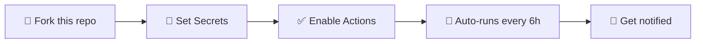
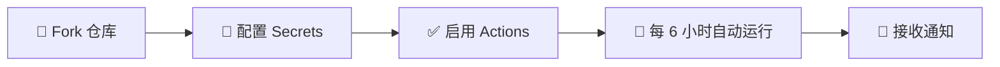

<!-- markdownlint-disable MD033 MD041 -->
<div align="center">

# 🚀 TransferShare — 百度网盘自动转存工具

**Baidu Pan Auto Transfer | 基于 GitHub Actions 的全自动网盘转存方案**

[](https://www.python.org/)
[](https://github.com/features/actions)
[](LICENSE)
[](https://github.com/Jack261108/transfershare/actions/workflows/test-on-push.yml)
[](https://docs.astral.sh/ruff/)

[English](#english) | [中文](#中文文档)

</div>

---

<a id="english"></a>

## What is TransferShare?

TransferShare is an **open-source, zero-cost automation tool** that periodically saves files from [Baidu Pan](https://pan.baidu.com) share links into your own Baidu Pan storage — powered entirely by **GitHub Actions** (no server needed).

**Use cases:**
- 🎓 Auto-save course materials from shared folders
- 📚 Build a personal library from community shares
- 🔄 Keep shared resources synced to your own drive
- 📦 Batch archive shared links with custom filters

### Key Features

| Feature | Description |
|---------|-------------|
| ⏰ **Scheduled Execution** | Runs automatically every 6 hours via GitHub Actions cron — set and forget |
| 🔐 **Password-Protected Links** | Full support for share links with extraction codes (`?pwd=xxxx`) |
| 📦 **Batch Processing** | Transfer hundreds of share links in a single run |
| 🧠 **Smart Deduplication** | Skips already-existing files by MD5 comparison — no duplicate downloads |
| 📁 **Per-Link Configuration** | Each link can have its own save directory, filter rules, and rename patterns |
| 🔍 **Regex Filtering** | Filter files by name pattern; filter folders by regex; exclude unwanted content |
| ✏️ **Auto Rename** | Rename files during transfer using regex capture groups |
| 📱 **WeChat Notifications** | Get notified via Enterprise WeChat webhook when transfers complete |
| 🔁 **Failure Retry** | Failed transfers are automatically retried across runs with encrypted state |
| 🔒 **Security First** | Cookies are masked in logs; state files are encrypted; minimal permissions |
| ⚡ **Tunable Concurrency** | Configurable parallel workers for multi-share, rename, and scanning operations |
| 🛡️ **Robust Error Handling** | Classified errors (network / rate-limit / cookie-invalid) with smart retry logic |

### Quick Start



**Step 1 — Fork** this repository

**Step 2 — Get your Baidu Pan cookies** (BDUSS + STOKEN):
```bash
# Option A: Use the built-in browser helper (recommended)
pip install -r requirements-playwright.txt && python -m playwright install
python save_baidu_cookies.py --repo YOUR_USERNAME/transfershare

# Option B: Manual — open pan.baidu.com → F12 → Application → Cookies → copy BDUSS & STOKEN
```

**Step 3 — Configure GitHub Secrets** (`Settings → Secrets → Actions`):

| Secret | Required | Description |
|--------|----------|-------------|
| `BAIDU_COOKIES` | ✅ | `BDUSS=xxx; STOKEN=xxx` |
| `SHARE_URLS` | ✅ | Share links, one per line (see [format](#share-link-format)) |
| `SAVE_DIR` | | Default save directory (default: `/AutoTransfer`) |
| `WECHAT_WEBHOOK` | | Enterprise WeChat webhook URL |
| `TRANSFERSHARE_STATE_KEY` | | Encryption key for cross-run failure state (`openssl rand -base64 32`) |

**Step 4 — Done!** The workflow runs at UTC 0:17, 6:17, 12:17, 18:17 automatically. Or trigger manually from the Actions tab.

### Example Config (`config.json` for local runs)

```json
{
  "cookies": "BDUSS=xxx; STOKEN=xxx",
  "share_urls": [
    "https://pan.baidu.com/s/xxxxx?pwd=abcd /Courses/Math",
    "https://pan.baidu.com/s/yyyyy?pwd=efgh",
    {
      "share_url": "https://pan.baidu.com/s/zzzzz?pwd=ijkl",
      "save_dir": "/Videos",
      "folder_filter": "2024|2025",
      "regex_pattern": "\\.(mp4|mkv)$"
    }
  ],
  "save_dir": "/AutoTransfer",
  "wechat_webhook": ""
}
```

> 📖 Full configuration reference: [CONFIG_GUIDE.md](CONFIG_GUIDE.md)

---

<a id="中文文档"></a>

## TransferShare 是什么？

TransferShare 是一个**开源、免费**的百度网盘自动转存工具。它利用 **GitHub Actions** 定时任务，每隔六小时自动将分享链接中的文件转存到你自己的网盘中 —— **无需服务器，无需付费**。

**适用场景：**
- 🎓 自动转存课程资料、学习资源
- 📚 从社群分享链接构建个人资源库
- 🔄 定期同步共享文件夹的更新内容
- 📦 批量归档带过滤条件的分享链接

## ✨ 项目亮点

<div align="center">

| 特性 | 描述 |
|------|------|
| ⏰ **定时自动执行** | 基于 GitHub Actions cron，每 6 小时自动运行，无需人工干预 |
| 🔐 **密码链接支持** | 完美支持带提取码的分享链接 |
| 📦 **批量转存** | 一次运行可处理上百个分享链接 |
| 🧠 **智能去重** | 通过 MD5 对比自动跳过已存在的文件 |
| 📁 **逐链接配置** | 每个链接可独立设置保存目录、过滤规则、重命名模式 |
| 🔍 **正则过滤** | 支持文件名正则过滤、文件夹正则过滤、排除规则 |
| ✏️ **自动重命名** | 通过正则捕获组在转存时重命名文件 |
| 📱 **企业微信通知** | 转存完成后通过企业微信 Webhook 推送结果 |
| 🔁 **失败自动重试** | 失败任务加密持久化，下次运行自动重试 |
| 🔒 **安全优先** | Cookie 日志脱敏、状态文件加密、最小权限原则 |
| ⚡ **并发可调** | 多链接并发、重命名并发、扫描并发均可配置 |
| 🛡️ **健壮的错误处理** | 按错误类型分类（网络/限频/Cookie失效），智能重试策略 |

</div>

## 🚀 快速开始



### 第一步：Fork 仓库

点击右上角 **Fork** 按钮，将仓库复制到你的 GitHub 账户。

### 第二步：获取百度网盘 Cookies

**推荐方式 — 脚本自动获取：**
```bash
pip install -r requirements-playwright.txt && python -m playwright install
python save_baidu_cookies.py --repo YOUR_USERNAME/transfershare
```
脚本会打开浏览器，扫码登录后自动提取 Cookie 并写入 GitHub Secrets。

**手动方式：**
1. 登录 [百度网盘网页版](https://pan.baidu.com)
2. 按 `F12` 打开开发者工具
3. `Application` → `Cookies` → `https://pan.baidu.com`
4. 复制 `BDUSS` 和 `STOKEN` 的值
5. 组合格式：`BDUSS=你的BDUSS值; STOKEN=你的STOKEN值`

### 第三步：配置 GitHub Secrets

进入 `Settings` → `Secrets and variables` → `Actions`，添加以下 Secrets：

| Secret 名称 | 必需 | 说明 |
|-------------|------|------|
| `BAIDU_COOKIES` | ✅ | 百度网盘 Cookies，格式：`BDUSS=xxx; STOKEN=xxx` |
| `SHARE_URLS` | ✅ | 分享链接列表，每行一个（格式见下方说明） |
| `SAVE_DIR` | | 默认保存目录，默认 `/AutoTransfer` |
| `WECHAT_WEBHOOK` | | 企业微信机器人 Webhook URL |
| `TRANSFERSHARE_STATE_KEY` | | 加密失败清单的密钥，用 `openssl rand -base64 32` 生成 |

<a id="share-link-format"></a>

### 分享链接格式

```
# 基本格式
https://pan.baidu.com/s/xxxxxx?pwd=abcd

# 指定保存目录（链接后加空格和目录路径）
https://pan.baidu.com/s/xxxxxx?pwd=abcd /我的资源/课程

# 对象格式（高级，可单独配置过滤规则）
{
  "share_url": "https://pan.baidu.com/s/xxxxxx",
  "pwd": "abcd",
  "save_dir": "/视频",
  "folder_filter": "2024|2025",
  "regex_pattern": "\\.(mp4|mkv)$"
}
```

### 第四步：完成！

工作流会自动在 UTC 时间 0:17、6:17、12:17、18:17 运行。也可以在 Actions 页面手动触发。

## ⚙️ 详细配置

### config.json（本地运行优先读取）

程序优先读取项目根目录的 `config.json`，文件不存在时回退到环境变量。

**简单配置：**
```json
{
  "cookies": "BDUSS=xxx; STOKEN=xxx",
  "share_urls": [
    "https://pan.baidu.com/s/xxxxx?pwd=abcd /资料",
    "https://pan.baidu.com/s/yyyyy?pwd=efgh"
  ],
  "save_dir": "/AutoTransfer"
}
```

**带全局过滤：**
```json
{
  "cookies": "BDUSS=xxx; STOKEN=xxx",
  "share_urls": [
    "https://pan.baidu.com/s/xxxxx?pwd=abcd /课程"
  ],
  "save_dir": "/AutoTransfer",
  "folder_filter": "2024|2025",
  "regex_pattern": "\\.(pdf|epub)$"
}
```

**逐链接配置：**
```json
{
  "cookies": "BDUSS=xxx; STOKEN=xxx",
  "save_dir": "/AutoTransfer",
  "share_urls": [
    {
      "share_url": "https://pan.baidu.com/s/xxxxx?pwd=abcd",
      "save_dir": "/视频课程",
      "folder_filter": "高级班",
      "regex_pattern": "\\.(mp4|mkv)$"
    },
    {
      "share_url": "https://pan.baidu.com/s/yyyyy?pwd=efgh",
      "save_dir": "/电子书",
      "regex_pattern": "\\.(pdf|epub)$"
    }
  ]
}
```

> 📖 完整配置文档请参考 [CONFIG_GUIDE.md](CONFIG_GUIDE.md)

### 高级功能

#### 文件夹过滤

```json
{
  "folder_filter": "2024|2025",
  "exclude_folder_filter": "预告|花絮"
}
```
- `folder_filter`：只转存匹配的文件夹（支持字符串或数组）
- `exclude_folder_filter`：跳过匹配的文件夹

#### 文件过滤与重命名

```json
{
  "regex_pattern": ".*课程(\\d+).*\\.mp4$",
  "regex_replace": "第\\1课.mp4"
}
```
- 只设置 `regex_pattern`：过滤文件（只转存匹配的）
- 同时设置 `regex_replace`：过滤 + 重命名

#### 性能调优

| 环境变量 | 默认值 | 说明 |
|---------|--------|------|
| `TRANSFERSHARE_MULTI_SHARE_CONCURRENCY` | `1` | 多链接并发数（建议 ≤ 4） |
| `TRANSFERSHARE_RENAME_CONCURRENCY` | `1` | 重命名并发数 |
| `TRANSFERSHARE_LOCAL_SCAN_CONCURRENCY` | `1` | 本地扫描并发数 |
| `TRANSFERSHARE_TRANSFER_PIPELINE` | `1` | 流水线双缓冲开关 |
| `TRANSFERSHARE_PCS_POOL_MAXSIZE` | 自动 | HTTP 连接池大小 |

推荐启用顺序：先开 `RENAME_CONCURRENCY=4`，再开 `MULTI_SHARE_CONCURRENCY=2~4`。

## 🏗️ 本地运行

```bash
# 克隆仓库
git clone https://github.com/Jack261108/transfershare.git
cd transfershare

# 初始化子模块并安装依赖
git submodule update --init --recursive
pip install -r requirements.txt
./scripts/build_baidupcs_submodule.sh

# 配置
cp config.example.json config.json
# 编辑 config.json 填入你的 cookies 和分享链接

# 运行
python transfer_runner.py
# 或使用包装脚本（推荐，自动处理子模块构建和 PYTHONPATH）
./scripts/run_transfer_task.sh
```

### 运行测试

```bash
pip install -r requirements-test.txt
python -m unittest discover -s tests -p "test_*.py"
```

## 🛠 故障排除

| 问题 | 解决方案 |
|------|---------|
| Cookies 无效 | 重新获取 Cookies 并更新 `BAIDU_COOKIES` |
| 分享链接失效 | 检查链接是否仍有效，更新 `SHARE_URLS` |
| 频率限制 (`error_code: -65`) | 降低并发数或增加节流延迟 |
| 网络超时 | 已内置指数退避重试，多重试几次；或本地运行 |
| 企业微信通知失败 | 检查 Webhook URL 是否正确，机器人是否已加入群聊 |

## ⚠️ 注意事项

<div align="center">

1. 仅支持 `https://pan.baidu.com/s/xxxxx?pwd=xxxx` 格式
2. 妥善保管 Cookies，切勿泄露或提交到仓库
3. 合理设置执行频率，避免触发百度限制
4. 确保百度网盘有足够的存储空间
5. 确保分享链接的有效性和合法性

</div>

## 📄 许可证

本项目采用 [MIT 许可证](LICENSE)。

## 🤝 贡献

欢迎提交 Issue 和 Pull Request！

<div align="center">

---

**如果这个项目对你有帮助，请给它一个 ⭐️**

[](https://github.com/Jack261108/transfershare/stargazers)
[](https://github.com/Jack261108/transfershare/network/members)

</div>
